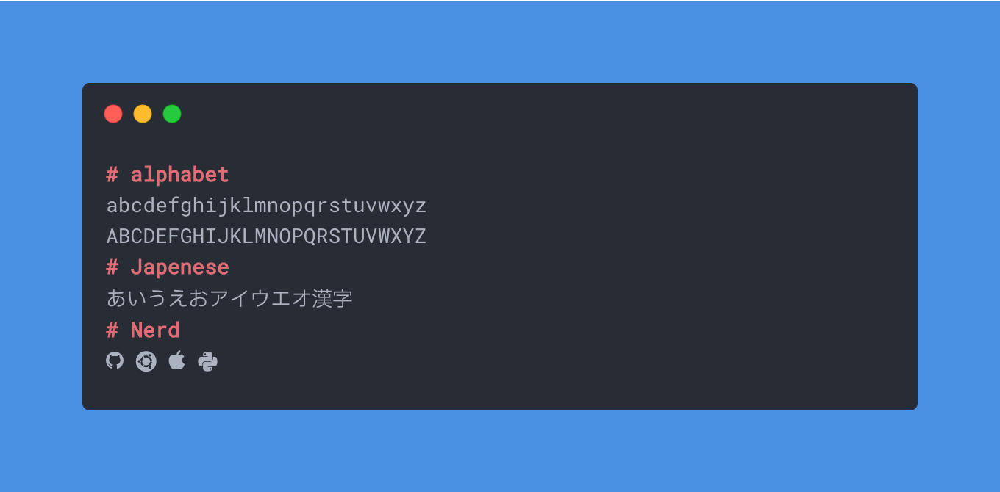

# Roboto Mono JP



このフォントは，Roboto MonoとIBM Plex Sans JPを合成し，
Nerd Font Patcherを適用したものです．

同梱している各フォントは配布元のライセンス表記に従います．

`Roboto Mono JP` is merged Roboto Mono, IBM Plex Sans JP and Nerd Font.  
Fonts included in the package are subject to the license terms of the distributor.

Download: https://github.com/mjun0812/RobotoMonoJP/releases

## Build

required: fontforge, python

fontforgeのPythonスクリプト機能を使うには、systemにインストールされたPythonを使う必要があります。

```bash
git clone https://github.com/mjun0812/RobotoMonoJP.git
cd RobotoMonoJP
python generate.py
```

## References

- [SF Mono を使って最高のプログラミング用フォントを作った話 - Qiita](https://qiita.com/delphinus/items/f472eb04ff91daf44274)
- [yanoasis/nerd-fonts](https://github.com/ryanoasis/nerd-fonts)
- [IBM/plex](https://github.com/IBM/plex)
- [Google Fonts](https://fonts.google.com/specimen/Roboto+Mono)
- [RobotoMonoに日本語を合成したフォントを作りました](https://note.mjunya.com/posts/2021-12-28-roboto-mono-jp/)
- [プログラミング用フォント Utatane](https://github.com/nv-h/Utatane/blob/master/utatane.py)