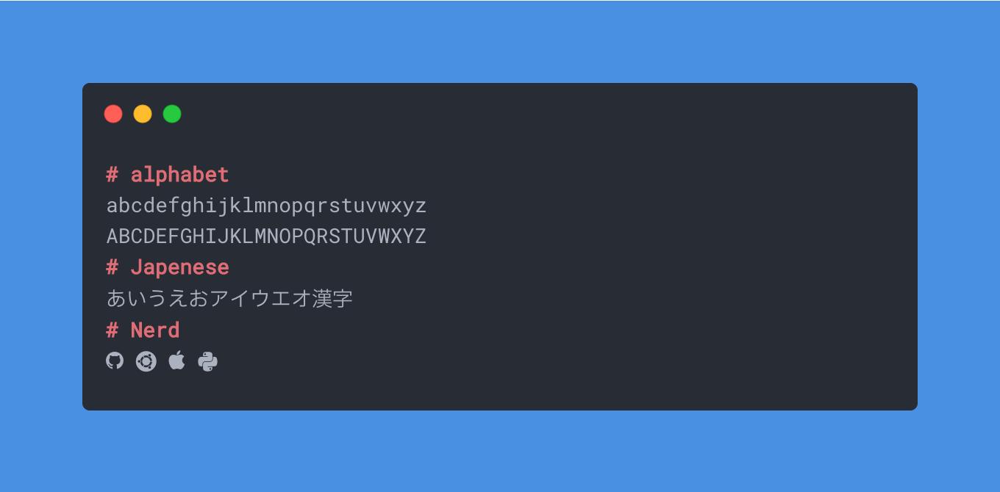

# Roboto Mono JP



Roboto Mono と日本語フォントを合成し、Nerd Fonts の glyph を追加したプログラミング用フォントを生成する CLI です。

Download: <https://github.com/mjun0812/RobotoMonoJP/releases>

## 生成されるフォント

`config.yaml` の `jp_identifier` から family name を決定します。

例として `jp_identifier: Plex` の場合、`RobotoMonoPlex` を生成します。
Roboto Mono 由来の幅を維持したまま日本語フォントを合成します。

`Regular` / `Bold` / `Italic` / `BoldItalic` の各 style で `ttf` と `otf` を出力し、合計 8 ファイルになります。

出力先は次の形式です。

```text
dist/{familyname}/{familyname}-{style}.ttf
dist/{familyname}/{familyname}-{style}.otf
```

## 必要なもの

- Docker
- Git submodule

FontForge の Python bindings が必要なため、フォント生成は Docker 上で実行します。

## セットアップ

```bash
git clone https://github.com/mjun0812/RobotoMonoJP.git
cd RobotoMonoJP
make submodule-init
make docker-build
```

`make submodule-init` は `vendor/nerd-fonts` を初期化し、Nerd Fonts の `font-patcher` と必要な glyph だけを sparse-checkout します。

## 生成

`config/*.yaml` を指定して全 style を生成します。`CONFIG` を省略すると `config/plex.yaml` を使います。

```bash
make generate CONFIG=config/{font}.yaml
```

Regular だけを生成する場合は次のコマンドを使います。

```bash
make generate-regular CONFIG=config/{font}.yaml
```

Makefile を使わずに直接実行する場合は、Docker コンテナ内で CLI を呼び出します。

```bash
docker run --rm -v "$PWD:/app" -w /app robotomonojp:dev \
  python3 -m robotomonojp generate -c config/{font}.yaml -o dist
```

主な CLI オプションは次の通りです。

```bash
python3 -m robotomonojp generate \
  --config config/{font}.yaml \
  --output dist \
  --style Regular
```

- `-c` / `--config`: 設定ファイル
- `-o` / `--output`: 出力先ディレクトリ。デフォルトは `dist`
- `--style`: `Regular` / `Bold` / `Italic` / `BoldItalic`。複数指定可
- `--no-nerd-font`: Nerd Fonts の patch をスキップ
- `--version-suffix`: フォント version に suffix を付与

## フォント確認PDF

生成済みフォントでサンプル文字列を PDF に出力できます。
`TEXT` を省略すると、英数字・かな・漢字・全角/曖昧幅記号・Nerd Fonts (source別) を網羅したデフォルト文字列を使います。

```bash
make print
make print FONT=dist/{familyname}/{familyname}-Regular.ttf TEXT="Roboto Mono 日本語 123" OUT=preview.pdf
```

直接実行する場合は次の形式です。

```bash
python3 -m robotomonojp print <font-path> "sample text" --output preview.pdf
```

## 日本語フォントを追加する手順

手順、調整すべき設定、確認すべき文字のガイドを [docs/add_japanese_font.md](docs/add_japanese_font.md) にまとめています。

## 設定ファイル

設定できる全項目は次の通りです。未知のキーはエラーになります。

| キー                 | 必須 | デフォルト     | 説明                                                                                             |
| -------------------- | ---- | -------------- | ------------------------------------------------------------------------------------------------ |
| `jp_identifier`      | ○    | -              | family name に使う識別子。先頭大文字の ASCII 英数字、最大16文字。`Mono` は予約されているため不可 |
| `familyname`         | -    | 命名規則で生成 | family name を明示指定して `RobotoMono{jp_identifier}` の命名規則を上書き                        |
| `metadata.copyright` | -    | 組み込み値     | フォントに埋め込む copyright 文字列                                                              |
| `metadata.vendor`    | -    | `mjun`         | OS/2 テーブルの vendor ID                                                                        |
| `fonts.en.regular`   | ○    | -              | 英字フォント (Roboto Mono) の Regular のパス                                                     |
| `fonts.en.bold`      | ○    | -              | 英字フォントの Bold のパス                                                                       |
| `fonts.jp.regular`   | ○    | -              | 日本語フォントの Regular のパス                                                                  |
| `fonts.jp.bold`      | ○    | -              | 日本語フォントの Bold のパス                                                                     |
| `italic_angle`       | -    | `-11.0`        | `Italic` / `BoldItalic` 生成時に skew する角度 (度)                                              |
| `ascent`             | ○    | -              | ascent (typo ascent にも使用)                                                                    |
| `descent`            | ○    | -              | descent (typo descent にも使用)                                                                  |
| `em`                 | ○    | -              | em サイズ。`ascent + descent` と一致している必要がある                                           |
| `en_width`           | ○    | -              | 半角カナ (U+FF61-FF9E) と曖昧幅記号 (`○` `→` など) に設定する幅                                  |
| `jp_width`           | ○    | -              | 全角 glyph (ひらがな・カタカナ・漢字・全角記号) に設定する幅                                     |
| `jp_scale_offset`    | ○    | -              | JP フォントのスケール倍率 (`ascent / 元JPフォントのascent`) に加算する offset                    |
| `underline_pos`      | ○    | -              | 下線の位置                                                                                       |
| `underline_height`   | ○    | -              | 下線の太さ                                                                                       |
| `os2_ascent`         | ○    | -              | OS/2 winAscent と hhea ascent                                                                    |
| `os2_descent`        | ○    | -              | OS/2 winDescent と hhea descent (正の値で指定)                                                   |

`Italic` / `BoldItalic` の入力フォントは指定不要で、`regular` / `bold` から生成します。

詳細な仕様は [docs/spec.md](docs/spec.md) を参照してください。

## 開発

```bash
make lint
make test
```

`make lint` は `ruff format --check` と `ruff check` を実行します。
`make test` は `pytest` を実行します。

### 新しい日本語フォントを追加するときの作業

[docs/add_japanese_font.md](docs/add_japanese_font.md) を参照してください。

## 参考

- [SF Mono を使って最高のプログラミング用フォントを作った話 - Qiita](https://qiita.com/delphinus/items/f472eb04ff91daf44274)
- [ryanoasis/nerd-fonts](https://github.com/ryanoasis/nerd-fonts)
- [IBM/plex](https://github.com/IBM/plex)
- [Google Fonts](https://fonts.google.com/specimen/Roboto+Mono)
- [RobotoMonoに日本語を合成したフォントを作りました](https://note.mjunya.com/posts/2021-12-28-roboto-mono-jp/)
- [プログラミング用フォント Utatane](https://github.com/nv-h/Utatane/blob/master/utatane.py)
- [プログラミング用合成フォント PleckJP を作った](https://ryota2357.com/blog/2023/dev-font-pleckjp/)
- [プログラミング用合成フォント PleckJP の合成スクリプトの実装解説](https://ryota2357.com/blog/2023/pleck-jp-impl-exp/)
- [ryota2357/PleckJP](https://github.com/ryota2357/PleckJP)
